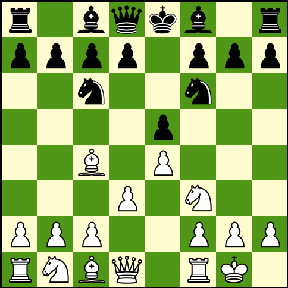

# fen2pil

Convert Forsyth–Edwards Notation (FEN) to a 2D chessboard PIL image.

```python
from fen2pil import draw

fen = "r1bqkb1r/pppp1ppp/2n2n2/4p3/2B1P3/3P1N2/PPP2PPP/RNBQ1RK1 w Qkq - 0 1"

pil_image = draw.transform_fen_pil(
        fen=fen,
        board_size=480,
        light_color=(255, 253, 208),
        dark_color=(76, 153, 0)
    )

pil_image.show()

```




